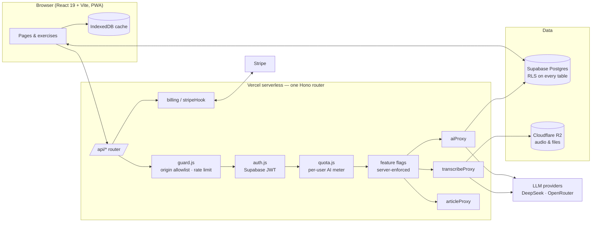

# Langrok — engineering showcase

**Live:** [langrok.app](https://langrok.app) · **Status:** pre-launch, in active development · **Author:** [Yi Sun](https://www.linkedin.com/in/yi-sun-05770720b)

Langrok is a language-immersion web app: you import an article, a PDF, a photographed page or a podcast, and it becomes reading, dictation, grammar and translation exercises with LLM feedback, in five languages (FR · EN · ES · DE · IT).

The product code is private because Langrok is being prepared for commercial launch. This repository documents **how it is built**, with the architecture, the engineering decisions and sanitized excerpts, so that the work can be evaluated without the business logic. Full read access to the source can be arranged for interviews.

## By the numbers (Mar – Oct 2026)

| | |
|---|---|
| Commits | 700+ |
| Merged pull requests | 80+ |
| Codebase | ~59k lines (React + Node) |
| Server modules | 28 (one per external concern: AI, speech, transcription, billing, storage, analytics…) |
| Unit test files | 130+ (Vitest) |
| End-to-end suites | Playwright, desktop and mobile |
| Tables under row-level security | 8 |
| Team | 1 (design, front end, back end, infra, ops) |

## Architecture



**Request path for any AI call:** origin check → rate limit (per feature bucket) → JWT verification → quota (Postgres, atomic RPC) → feature flag → provider call with server-side clamps (model allow-list, token ceiling, payload size). The API key never reaches the browser.

## Engineering decisions worth reading

Each one is written up in [`docs/DECISIONS.md`](docs/DECISIONS.md). Short version:

1. **One router instead of twelve serverless functions.** The hosting plan capped the project at 12 functions; the design was starting to bend around the quota (two unrelated jobs sharing a URL). One Hono router, lazily importing each handler at call time so cold starts stay proportional to the request.
2. **Every LLM call goes through a server proxy that assumes it is being abused.** Origin allowlist, per-bucket rate limits, model allow-list, token and payload clamps, per-user metering in Postgres. Rate limits are in-memory and therefore per-instance on serverless, so the *real* ceiling lives in the database.
3. **Quota fails open, loudly.** A bookkeeping outage should not lock every user out; it should log a warning and let the call through. The spend cap on the provider dashboard is the backstop.
4. **Data isolation is enforced by the database, not the client.** Every user-owned table has row-level security policies; the frontend could be fully compromised and still only read its own rows.
5. **Feature flags are enforced server-side, not just hidden in the UI.** When the transcription provider's free tier turned out to cap throughput at ~6 podcast episodes per hour *for all users combined*, listening was paused with one flag: the nav link, cards, import tab and route disappear together, and `/api/transcribe` answers `503 feature_paused` so an already-open tab cannot keep spending the quota.
6. **Provider-agnostic AI layer.** Any OpenAI-compatible endpoint is a configuration change (`AI_BASE_URL`, `AI_MODEL`), including a mainland-China deployment; provider-specific parameters are only sent to providers known to accept them.
7. **Ops questions are SQL first, dashboards later.** Signup funnel, time-to-first-read, retention, failed imports, AI cost per user: all plain `SELECT`s in `supabase/ops.sql`. The admin UI gets built once three of them have become a daily reflex.

## Testing and evaluation

- **Unit:** 130+ Vitest files covering scheduling, grading, diffing, parsing and every server module (proxies are tested with injected fetch/provider doubles).
- **End-to-end:** Playwright suites for landing, reading, notes and mobile layouts; screenshot scripts for visual regressions.
- **Eval harness:** the article extractor is a hand-rolled heuristic whose failures are silent (a mangled preview). `scripts/evalArticle.mjs` pins its behaviour on fixture pages (offline, CI-safe) and prints a quality report for any live URL, including a `liveBlogSuspect` flag that is the same heuristic a future UI hint would use.

## Companion project: Recall

[Recall](docs/RECALL.md) turns photographed textbook pages and documents into spaced-repetition cards. Same stack, different problems:

- **Multimodal streaming import:** pages go straight to a vision model, three in parallel, cards appear while later pages are still rendering; images are resized client-side before upload; JSON mode with automatic fallback per provider.
- **Grounding check against hallucinations:** any generated answer that cannot be found in the extracted source text (case-, accent- and inflection-tolerant) is dropped, and the user is told how many were removed.
- **Golden-set benchmark:** `npm run bench` replays the *production* import pipeline over hand-annotated samples (e.g. 159 expected items for one textbook unit) and reports misses and extras, so every prompt change is measured, not eyeballed.
- **Three-outcome SRS:** SM-2 reduced to right / close / wrong, because the grade comes from a model reading what you typed, not from self-rating.

## Stack

React 19 · Vite · React Router · Mantine · BlockNote · Hono · Supabase (Postgres, Auth, Storage, RLS) · Vercel serverless · Cloudflare R2 · Stripe · DeepSeek / OpenRouter APIs · Vitest · Playwright · ESLint

## What is in this repo

```
README.md            this page
docs/ARCHITECTURE.md request flow, gates, data model (sanitized)
docs/DECISIONS.md    the seven decisions above, with the trade-offs
docs/RECALL.md       the companion project
snippets/            short, sanitized excerpts of real code
```

Built with AI-assisted development (Claude Code) as a daily tool; every architectural decision, review and merge is mine.
